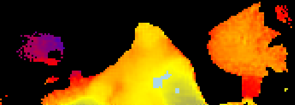
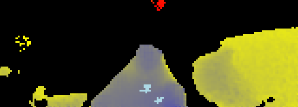
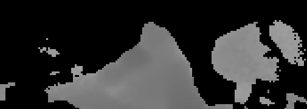
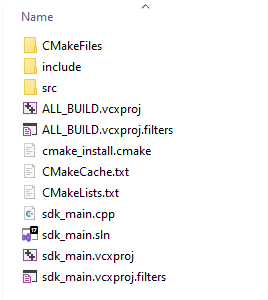
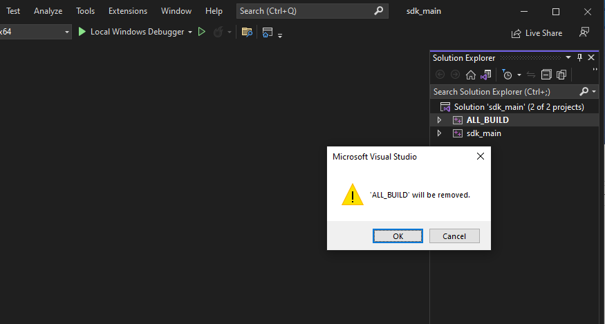
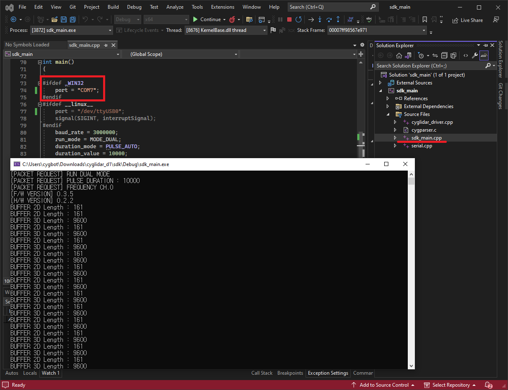
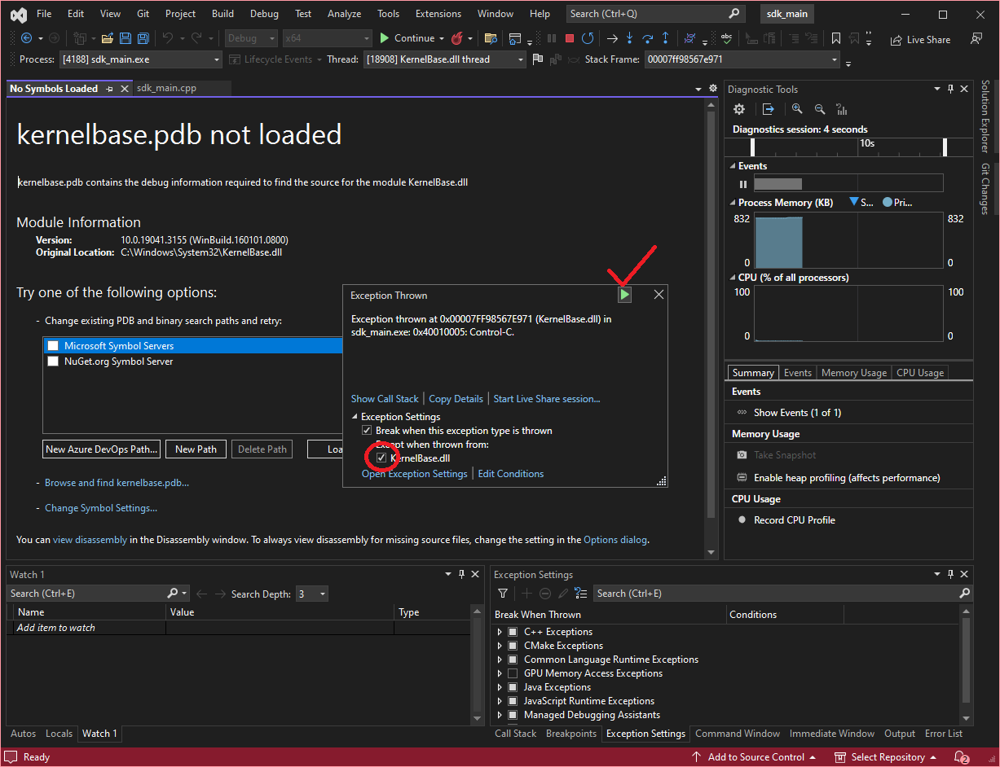

# cyglidar_d1(ROS2)
cyglidar_d1 is a ROS package, which is designed to visualize 2D/3D distance dataset in real-time.
For more details in CygLiDAR, please visit http://www.cygbot.com

ROS1 Package : https://github.com/CygLiDAR-ROS/cyglidar_d1/tree/ROS1-v0.3.0

## How to use this package

### Preparation
```bash
mkdir -p ~/cyglidar_ws/src/
cd ~/cyglidar_ws/src/
git clone -b ROS2-v0.3.0 https://github.com/CygLiDAR-ROS/cyglidar_d1.git
cd ..
colcon build
source install/setup.bash
```
* When CMake Error Occured as below
>pcl_conversionsConfig.cmake / pcl_conversions-config.cmake

```bash
sudo apt install ros-{ROS2 Ver Name}-pcl-conversions
```

### Installation Udev
Install the udev rule
```bash
cd ~/cyglidar_ws/src/cyglidar_d1/scripts
chmod +x create_udev_rules.sh
./create_udev_rules.sh
```

### Parameters in 'cyglidar.launch.py' File
In cyglidar.launch, you can adjust parameter value

* baud_rate → "baud rate value [0:(3,000,000), 1:(921,600), 2:(115,200), 3:(57,600)]"
* run_mode → "version type [0:(MODE_2D), 1:(MODE_3D), 2:(MODE_DUAL)]"
* frequency_channel → "frequency Ch. [0 to 15]"
* duration_mode → "pulse mode [0 : (Auto), 1 : (Manual)]"
* duration_value → "pulse duration [0 to 10000] "
* color_mode → "color mode [0 (MODE_HUE), 1 (MODE_RGB), 2 (MODE_GRAY)]"
* min_resolution → "min_resolution [0 to 3000] "
* max_resolution → "max_resolution [0 to 3000] "

### Topic Image Updated
---
#### MODE HUE
<h1 align="left">
  
</h1>

#### MODE RGB
<h1 align="left">
  
</h1>

#### MODE GRAY
<h1 align="left">
  
</h1>
The measured distance datas in Rviz can be viewed as an 'Image Topic', There are HUE / RGB / GRAY Mode. 
You can adjust 'color_mode' value which you want.

In ROS2 Package, You can adjust the min/max value as well. But, comapred with ROS1 package, you can adjust value with Launch Parameters.

### Run CyglidarNode and View in the Rviz
```bash
ros2 launch cyglidar_d1_ros2 cyglidar.launch.py
ros2 launch cyglidar_d1_ros2 view_cyglidar.launch.py  (Run with Rviz)
```

#1 When CyglidarNode Error Occured
>[Error] : An exception was thrown [open : Permission denied]
Please check 'Installation Udev' Or use following command.
```bash
sudo chmod 777 /dev/ttyUSB0
```

### Note
In Rviz, the fixed frame and the topics for Point Cloud are as follows:

##### Frame ID
```bash
/laser_frame
```

##### Fixed Frame
```bash
/map
```

##### Cyglidar Topic List
```bash
/scan       (LaserScan)
/scan_2D    (PointCloud XYZRGBA)
/scan_3D    (PointCloud XYZRGBA)
/scan_image (Image)
```

### Usage SDK
##### LINUX
Change Directory to 'cyglidar_d1/sdk' 
```
cmake .
make
./sdk_main
```

##### WINDOW
Unlike Linux, you have to check 'CMake' and 'Boost' libraries. Not installed yet, please visit below websites.
> https://cmake.org/download/
> https://www.boost.org/users/download/

All set-up prepared, Change Directory to 'cyglidar_d1/sdk' 
Using 'cmd' or 'powershell', put command below as Linux.
```
cmake .
make
```
If build successfully, Multiple files are created. Then click solution file as 'sdk_main.sln'
<h1 align="left">
  
</h1>

At the Solution Explorer, remove 'ALL_BUILD'
<h1 align="left">
  
</h1>

After some variables(like 'Port Number') revise, you can operate sdk code.
<h1 align="left">
  
</h1>

#1 When Exception 'kernalbase.pdb not loaded' Occured
When you put 'Ctrl + C' for shutting down program, Exception will occur.
This is an error caused by the generation of debug key values, but there is no problem with the operation of the program, so you can check and use it as below.
<h1 align="left">
  
</h1>
