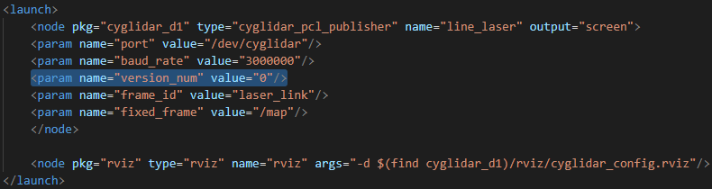
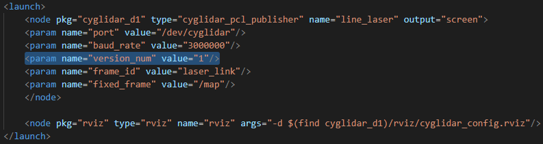
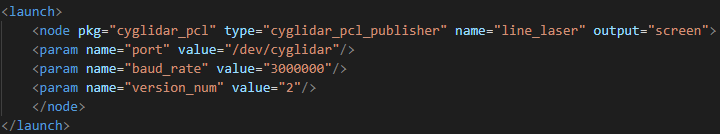

# cyglidar_d1
cyglidar_d1 is a ROS package, which is designed to visualize 2D/3D distance dataset in real-time.
For more details in CygLiDAR, please visit http://www.cygbot.com

## How to use this package

### Preparation
1) Clone this repository to your catkin's workspace
2) Run catkin_make

### Set-Up
Install the udev rule
```bash
roscd cyglidar_d1
cd scripts
chmod +x create_udev_rules.sh
./create_udev_rules.sh
```

### Parameters
In cyglidar.launch, the version number can be switched to 0, 1 and 2 for 2D, 3D and 2D/3D respectively as below:

2D)
<h1 align="left">
  
</h1>

3D)
<h1 align="left">
  
</h1>

2D/3D)
<h1 align="left">
  
</h1>

### Run
```bash
roslaunch cyglidar_d1 cyglidar.launch
```

### Note
In Rviz, the fixed frame and the topics for Point Cloud are as follows:

##### Fixed Frame
```bash
/laser_link
```

##### Topic
```bash
/scan_laser
/scan_2D
/scan_3D
```
