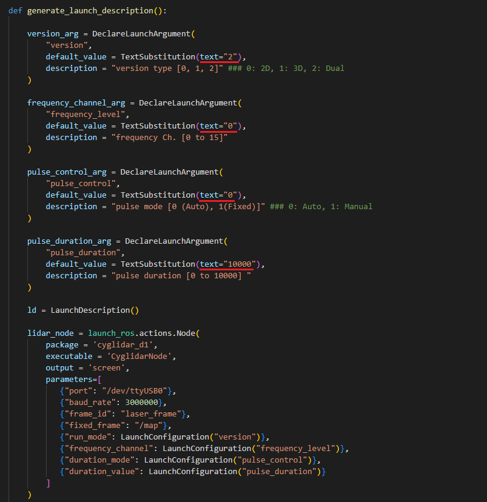

# cyglidar_d1
cyglidar_d1 is a ROS package, which is designed to visualize 2D/3D distance dataset in real-time.
For more details in CygLiDAR, please visit http://www.cygbot.com

## How to use this package

### Preparation
```bash
mkdir -p ~/cyglidar_ws/src/
cd ~/cyglidar_ws/src/
git clone -b ROS2-v0.3.0 https://github.com/CygLiDAR-ROS/cyglidar_d1.git
cd ..
colcon build
```
* When CMake Error Occured as below
>pcl_conversionsConfig.cmake / pcl_conversions-config.cmake

```bash
sudo apt install ros-{ROS2 Ver Name}-pcl-conversions
```

### Parameters in 'cyglidar.launch.py' File
In cyglidar.launch, the run mode number can be switched to 0, 1 and 2 for 2D, 3D and Dual(2D/3D)

And the others can be switched respectively as below:
<h1 align="left">
  
</h1>

### Run CyglidarNode and View in the Rviz
```bash
ros2 launch cyglidar_d1 cyglidar.launch.py
ros2 launch cyglidar_d1 view_cyglidar.launch.py  (Run with Rviz)
```
#1 When CyglidarNode Error Occured
>[Error] : An exception was thrown [open : Permission denied]

```bash
sudo chmod 777 /dev/ttyUSB0
```

#2 When CyglidarNode Error Occured(if running in FOXY version)
>[RTPS_QOS_CHECK Error] INCORRECT TOPIC QOS (rt/scan_laser): depth must be <= max_samples -> Function checkQos
```bash
echo "export RMW_IMPLEMENTATION=rmw_cyclonedds_cpp" >> ~/.bashrc
```

### Note
In Rviz, the fixed frame and the topics for Point Cloud are as follows:

##### Frame ID
```bash
/laser_frame
```

##### Fixed Frame
```bash
/map
```

##### Cyglidar Topic List
```bash
/scan_laser (LaserScan)
/scan_2D    (PointCloud XYZRGBA)
/scan_3D    (PointCloud XYZRGBA)
```
