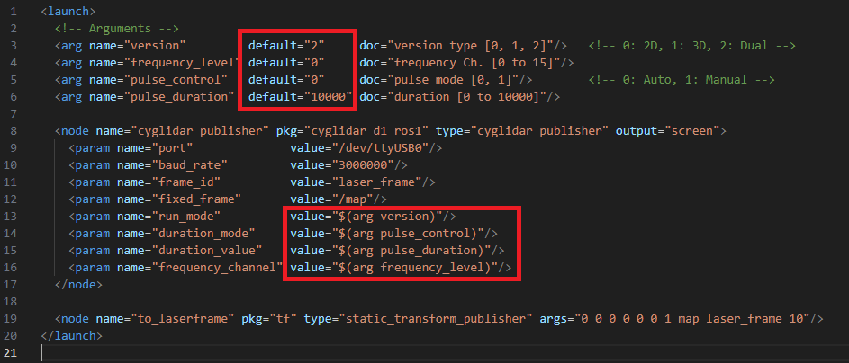
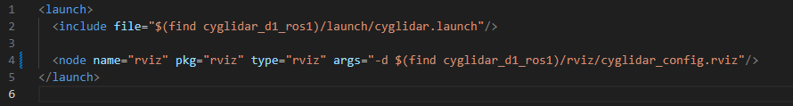

# cyglidar_d1
cyglidar_d1 is a ROS package, which is designed to visualize 2D/3D distance dataset in real-time.
For more details in CygLiDAR, please visit http://www.cygbot.com

## How to use this package

### Preparation
```bash
mkdir -p ~/cyglidar_ws/src/
cd ~/cyglidar_ws/src/
git clone https://github.com/CygLiDAR-ROS/cyglidar_d1.git
cd ..
catkin_make
```
* When CMake Error Occured as below
> pcl_conversionsConfig.cmake / pcl_conversions-config.cmake
>
> pcl_rosConfig.cmake / pcl_ros-config.cmake
```bash
sudo apt install ros-noetic-pcl-conversions
sudo apt install ros-noetic-pcl-ros
---or---
sudo apt install ros-melodic-pcl-conversions
sudo apt install ros-melodic-pcl-ros
```

### Installation Udev
Install the udev rule
```bash
roscd cyglidar_d1
cd scripts
chmod +x create_udev_rules.sh
./create_udev_rules.sh
```

### Parameters in 'cyglidar.launch' File
In cyglidar.launch, the run mode number can be switched to 0, 1 and 2 for 2D, 3D and Dual(2D/3D)

And the others can be switched respectively as below:
<h1 align="left">
  
</h1>

### Run CyglidarNode and View in the Rviz
<h1 align="left">
  
</h1>

```bash
roslaunch cyglidar_d1 cyglidar.launch
roslaunch cyglidar_d1 view_cyglidar.launch  (Run with Rviz)
```

### Note
In Rviz, the fixed frame and the topics for Point Cloud are as follows:

##### Frame ID
```bash
/laser_frame
```

##### Fixed Frame
```bash
/map
```

##### Cyglidar Topic List
```bash
/scan       (LaserScan)
/scan_2D    (PointCloud XYZRGBA)
/scan_3D    (PointCloud XYZRGBA)
```
