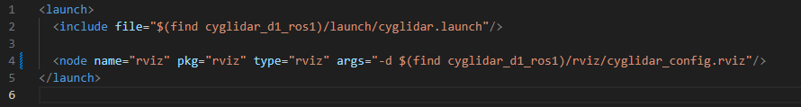

# cyglidar_d1(ROS1)
cyglidar_d1 is a ROS package, which is designed to visualize 2D/3D distance dataset in real-time.
For more details in CygLiDAR, please visit http://www.cygbot.com

## How to use this package

### Preparation
```bash
mkdir -p ~/cyglidar_ws/src/
cd ~/cyglidar_ws/src/
git clone https://github.com/CygLiDAR-ROS/cyglidar_d1.git
cd ..
catkin_make
```
* When CMake Error Occured as below
> pcl_conversionsConfig.cmake / pcl_conversions-config.cmake
>
> pcl_rosConfig.cmake / pcl_ros-config.cmake
```bash
sudo apt install ros-noetic-pcl-conversions
sudo apt install ros-noetic-pcl-ros
---or---
sudo apt install ros-melodic-pcl-conversions
sudo apt install ros-melodic-pcl-ros
```

### Installation Udev
Install the udev rule
```bash
roscd cyglidar_d1_ros1
cd scripts
chmod +x create_udev_rules.sh
./create_udev_rules.sh
```

### Parameters in 'cyglidar.launch' File
In cyglidar.launch, the run mode number can be switched to 0, 1 and 2 for 2D, 3D and Dual(2D/3D)

And the others can be switched respectively as below:
<h1 align="left">
  
</h1>

### Run CyglidarNode and View in the Rviz
<h1 align="left">
  
</h1>

```bash
roslaunch cyglidar_d1_ros1 cyglidar.launch
roslaunch cyglidar_d1_ros1 view_cyglidar.launch  (Run with Rviz)
```
### Topic Image Updated
<h1 align="left">
  
</h1>
The measured distance datas in Rviz can be viewed as an 'Image Topic(MONO16)'. You can adjust the min/max value to specify a view based on distance.

### Note
In Rviz, the fixed frame and the topics for Point Cloud are as follows:

##### Frame ID
```bash
/laser_frame
```

##### Fixed Frame
```bash
/map
```

##### Cyglidar Topic List
```bash
/scan       (LaserScan)
/scan_2D    (PointCloud XYZRGBA)
/scan_3D    (PointCloud XYZRGBA)
/scan_image (Image)
```

### Usage SDK
##### LINUX
Change Directory to 'cyglidar_d1/sdk' 
```
cmake .
make
./sdk_main
```

##### WINDOW
Unlike Linux, you have to check 'CMake' and 'Boost' libraries. Not installed yet, please visit below websites.
> https://cmake.org/download/
> 
> https://www.boost.org/users/download/

All set-up prepared, Change Directory to 'cyglidar_d1/sdk' 
Using 'cmd' or 'powershell', put command below as Linux.
```
cmake .
make
```
If build successfully, Multiple files are created. Then click solution file as 'sdk_main.sln'
<h1 align="left">
  
</h1>

At the Solution Explorer, remove 'ALL_BUILD'
<h1 align="left">
  
</h1>

After some variables revise, you can operate sdk code.
<h1 align="left">
  
</h1>

#1 When Exception 'kernalbase.pdb not loaded' Occured
When you put 'Ctrl + C' for shutting down program, Exception will occur.
This is an error caused by the generation of debug key values, but there is no problem with the operation of the program, so you can check and use it as below.
<h1 align="left">
  
</h1>

