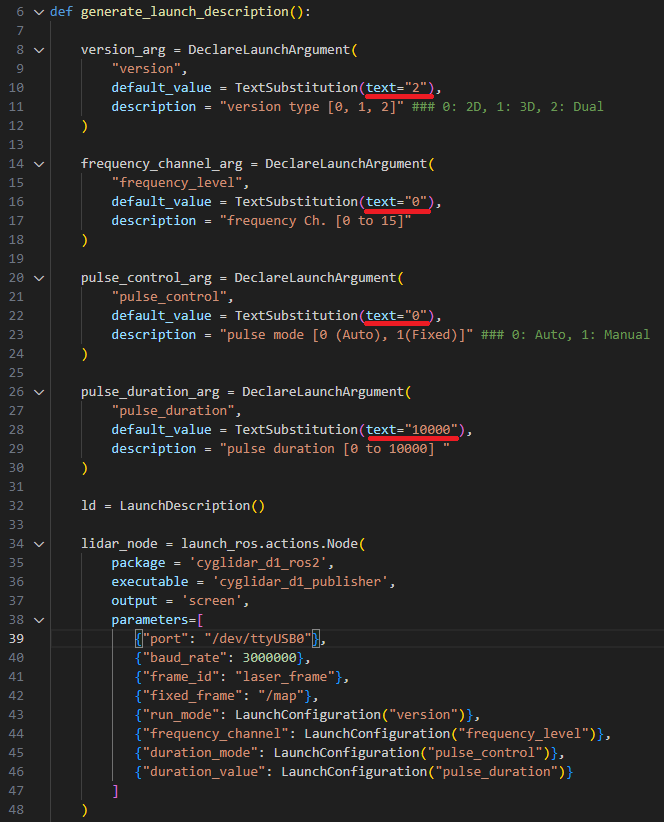

# cyglidar_d1(ROS2)
cyglidar_d1 is a ROS package, which is designed to visualize 2D/3D distance dataset in real-time.
For more details in CygLiDAR, please visit http://www.cygbot.com

## How to use this package

### Preparation
```bash
mkdir -p ~/cyglidar_ws/src/
cd ~/cyglidar_ws/src/
git clone -b ROS2-v0.3.0 https://github.com/CygLiDAR-ROS/cyglidar_d1.git
cd ..
colcon build
source install/setup.bash
```
* When CMake Error Occured as below
>pcl_conversionsConfig.cmake / pcl_conversions-config.cmake

```bash
sudo apt install ros-{ROS2 Ver Name}-pcl-conversions
```

### Installation Udev
Install the udev rule
```bash
cd ~/cyglidar_ws/src/cyglidar_d1/scripts
chmod +x create_udev_rules.sh
./create_udev_rules.sh
```

### Parameters in 'cyglidar.launch.py' File
In cyglidar.launch, the run mode number can be switched to 0, 1 and 2 for 2D, 3D and Dual(2D/3D)

And the others can be switched respectively as below:
<h1 align="left">
  
</h1>

### Topic Image Updated
<h1 align="left">
  
</h1>
The measured distance datas in Rviz can be viewed as an 'Image Topic(MONO16)'. You can adjust the min/max value to specify a view based on distance.

### Run CyglidarNode and View in the Rviz
```bash
ros2 launch cyglidar_d1_ros2 cyglidar.launch.py
ros2 launch cyglidar_d1_ros2 view_cyglidar.launch.py  (Run with Rviz)
```

#1 When CyglidarNode Error Occured
>[Error] : An exception was thrown [open : Permission denied]
Please check 'Installation Udev' Or use following command.
```bash
sudo chmod 777 /dev/ttyUSB0
```

### Note
In Rviz, the fixed frame and the topics for Point Cloud are as follows:

##### Frame ID
```bash
/laser_frame
```

##### Fixed Frame
```bash
/map
```

##### Cyglidar Topic List
```bash
/scan       (LaserScan)
/scan_2D    (PointCloud XYZRGBA)
/scan_3D    (PointCloud XYZRGBA)
/scan_image (Image)
```
